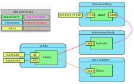

Todo:

* steps to replace critical values (mainly domain names and secrets)
* possibly a section on more advanced usage like multple users, groups, and TOTP

----

# Description

This is a set of containers all lashed together with docker compose that give you a broader set of authentication features than Caddy alone with HTTP basic auth. The advantage to deploying Silicon Notes this way is that if you decide to add services to the deployment in the future, doing so is borderline trivial.

Authelia has loads of features to explore but this example focuses on what is essentially the simplest possible use case. You would be well advised to read and be familiar with the full Authelia docs (painful though that is) if deploying this to anything resembling production.

There are four containers in play, and this is what each of them do:

* Silicon Notes, of course, is our wiki-like notes application that we want to host publicly but protect with HTTPS and some level of authentication.
* Caddy is the web server which serves as a reverse proxy and defers authentication to Authelia.
* [Authelia] provides the authentication and authorization mechanisms
* [LLDAP] is a simple, basic [LDAP] server that serves as Authelia's source of truth for user information. (Usernames, full names, email addresses, etc.)

[Authelia]: https://www.authelia.com
[LLDAP]: https://github.com/nitnelave/lldap

The last three will be described more fully in a moment but for now here is a diagram of how they are all put together and who talks to who:



A "normal" request looks something like this:

1. An HTTPS request for a page on Silicon Notes comes into Caddy on port 443.
2. Caddy Checks to see whether the user is authenticated based on the headers sent with the request.
  * If the user is not authenticated, it sends the user to Authelia to authenticate.
  * The user provides credentials and these are verfied against the records in LLDAP and the user is authenticated.
3. If the user is authenticated, proxy the request to Silicon.

## Silicon Notes

There's not much to the `silicon` container. The application listens for requests on port 5000 and keeps its data in a docker volume called `silicon_instance`.

## Caddy

[Caddy](https://caddyserver.com) is a web server with several interesting features. The ones we care about for the moment are:

* Simple configuration for a simple use case
* Reverse proxying
* TLS termination
* Automatic HTTPS certificate provisioning

It is essentially the centerpiece of the whole deployment, even though its the one you will never actually _see_ while using it.

### Ports

Caddy listens on ports 80 and 443. It will not actually serve any content up on port 80, it only listens on port 80 to redirect users to HTTPS on port 443.

### Configuration and Volumes

The Caddy container expects a config file to be at `/etc/caddy/Caddyfile`. That is accomplished in the top-level `configs` section and the `configs` section inside the `caddy` service.

The Caddy container also needs two persistent volumes: one for storing configuration (Caddy is dynamically configurable) and one for storing data related to Caddy's ongoing work, such as certificates and other HTTPS-related items.

### Environment

Caddy supports environment variable string substitution in its config file, as all reasonable programs should these days. In this case, our environment variables are defined in `.env`, get passed into the container via `docker-compose`, and the values are finally substituted in the `Caddyfile`.

`AUTH_FQDN` is the fully-qualified domain name of Authelia for this deployment and `SILICON_FQDN` is the same for Silicon.

### Networks

Caddy needs to speak directly to both Authelia and Silicon Notes, so it is joined to those networks.

## Authelia

Caddy's `forward_auth` directive allows caddy to defer authentication to another service. In this case, Authelia provides that.

### Ports

Authelia listens for HTTP connections on port 9091.

### Configuration and Volumes

The Authelia container stores configuration data in the `/config` directory. It also expects to find its main configuration file at `/config/configuration.yml`. You'll have to take the `configuration-example.yml` file in this directory, copy it to `configuration.yml`, and modify it to suit your needs. This process is described in greater detail below.

Although Authelia supports setting _some_ [configuration items as environment variables](https://www.authelia.com/configuration/methods/environment/), it does not support all that you will need to fully configure it. Thus, it is easiest to avoid using environment variables, in order to keep all of the Authelia configuration in one place.

(Note to self: we might at least put the secrets into environment variables...)

### Networks

There is a dedicated network between Caddy and Authelia.

## LLDAP

Authelia relies on LDAP (or a YAML file) to provide all user accounts, groups, and associated metadata. The traditional choice for this is OpenLDAP but it can be intimidating and time-consuming to configure correctly. By contrast, LLDAP is a simple (some might say, opinionated) LDAP implementation with just enough functionality to provide authentication and authorization on a smaller scale. It also has a pretty nice and simple web UI.

### Ports

The web UI for LLDAP is available on port 17170, but this example does not expose it publicly since it is not normally directly accessed by end users. Here, we expose it only to the localhost, the idea being that you (the admin) can access it via an SSH tunnel for adding/removing users and so forth.

If you really want to expose it publicly, you can do that easily enough tweaking the docker compose file, and adding a reverse proxy to it in Caddy.

### Volumes

LLDAP needs a persistent writable volume mounted to `/data` inside the container. It stores an sqlite user database there, possibly other things as well.

### Environment

At a minimum, LLDAP needs the following environment variables. Be sure to consult with the docs, there may be others you want to set depending on your particular deployment.

* `LLDAP_JWT_SECRET`: A random string of 32 alphanumeric characters or so
* `LLDAP_LDAP_USER_PASS`: The `admin` user password
* `LLDAP_LDAP_BASE_DN`: The "base distinguished name" for your domain, e.g. dc=example,dc=com)

### Networks

There is a dedicated network that allows Authelia to talk to LLDAP.

# Usage

## What You Will Need

### Somewhere to host it

There are essentially three obvious places to host a deployment like this, in rough order of preference:

1. A virtual private server or cloud instance.
2. A separate server on your local LAN.
3. On your local machine running Docker.

Deploying this to a VPS or cloud instance is the recommended option because it provides the most flexibility and availability. The other two options limit your access to a specific network or physical location, and how you allocate the IPs and configure the DNS (or not) are highly dependent on your specific network.

The rest of this guide will assume that you are deploying to a VM with a public IP address and domain name, or know enough about all of this to fake it with `/etc/hosts` as needed.

### A Domain Name and DNS Records

You will need your own domain name (or can borrow a friend's!) and the ability to create some subdomains. If our domain was `example.com`, we would need the following `A` records pointing to your VPS' IP address:

* `auth.example.com`: The subdomain for Authelia
* `silicon.example.com`: The subdomain for Silicon Notes

## Install Docker

If Git, Docker, and the Compose plugin are not installed already, install them:

```sh
# add the repo signing key
curl -sSLf https://download.docker.com/linux/ubuntu/gpg | sudo tee /usr/share/keyrings/docker.asc >/dev/null

# add apt sources.list
# NOTE: Be sure to change `arch` to your actual architecture if you are not on
# an x86-64 host.
echo "deb [arch=amd64 signed-by=/usr/share/keyrings/docker.asc] https://download.docker.com/linux/ubuntu $(lsb_release -sc) stable" > /etc/apt/sources.list.d/docker.list

# install docker
apt update
apt install git docker-ce docker-compose-plugin
```

## Clone Repo

Clone this repository:

```sh
git clone https://github.com/cu/silicon.git
```

## Environment Configuration

Copy the `.env-example` file to `.env`:

```sh
cp .env-example .env
```

You'll need to generate multiple longish random strings for the next step, here is one easy way. (Do this for each of the three secrets in the `.env` file.)

```sh
openssl rand -base64 33
```

Edit `.env` and change each variable as follows.

* `LLDAP_JWT_SECRET`: Change this to a random long string.
* `LLDAP_LDAP_USER_PASS`: This is the password for LLDAP's `admin` user. Set it to something reasonably secure.
* `LLDAP_LDAP_BASE_DN`: This is the "base distinguished name" of your LDAP tree. This has a particular format. For example, if your domain name is "example.com", you will set `dc=example,dc=com` here.
* `AUTH_FQDN`: The fully-qualified domain name for your instance of Authelia. For example, `auth.example.net`.
* `SILICON_FQDN`: The fully-qualified domain name for your instance of Silicon Notes. For example, `silicon.example.net`.
* `AUTHELIA_JWT_SECRET`: Change this to a random long string.
* `AUTHELIA_STORAGE_ENCRYPTION_KEY`: Change this to a random long string.

## Authelia Configuration

Copy the `configuration-example.yml` file to `configuration.yml` and edit it. The settings that should be changed are:

* `default_redirection_url`: Change this to the URL that Authelia should redirect to after successful authentication when it had no referrer. (For example, when you type https://auth.example.com/ into your URL bar.)
* `authentication_backend` -> `ldap`
  * `base_dn`: This is the "base distinguished name" of your LDAP tree. This has a particular format. For example, if your domain name is "example.com", you will set `dc=example,dc=com` here.
  * `user`: This is the "base distinguished name" of your LDAP user. All you have to change here are the last two parts for the domain, as above.
  * `password`: The LLDAP admin user password, as set in `.env`.
* `access_control` -> `rules` -> `domain`: set this to the same value as `SILICON_FQDN` in `.env` above. (This can also have a wildcard for the subdomain if protecting multiple sites, e.g. `*.example.com`.)
* `session` -> `domain`: Set this to your domain name.

## Start Containers

Once everything is configured, you should be able to start up the containers with:

```sh
docker compose up -d
```

Caddy takes care of all the heavy lifting here: setting up the proxy, fetching HTTPS certificates, and so on.

To check for errors in any of the containers, you can view the logs with:

```sh
docker compose logs
```

## Configure LDAP User

Before you can log into Silicon Notes, you need to add at least one user to LLDAP. Because this example "hides" the web UI for LLDAP, you will need to open up an SSH tunnel from your local workstation to the host running Docker. That will look something like this:

```sh
ssh -L 17170:127.0.0.1:17170 dockerhost.example.com
```

Open up a web browser tab to http://localhost:17170/ and add a user:

* (Insert steps here)

You can of course add more users if you would like.

## Log via Authelia

Once a user is added, you can now log into Silicon Notes via Authelia. Point your web browser to the value of `SILICON_FQDN`, e.g. https://silicon.example.com/. You should be redirected to Authelia for authentication, and then redirected back to Silicon if authentication was successful.
